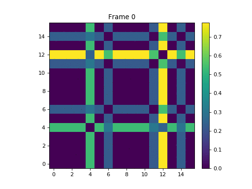

# chao-pwr
NC State's [Nonlinear Artificial Intelligence Lab](https://www.physics.ncsu.edu/NAIL/index.html) (formerly its Applied Chaos Lab) has constructed circuits which leverage an evolving chaotic dynamical system to implement logic functions.

For reasons elucidated in ``doc``, the lab wondered if these "[chaotic logic gates](https://ieeexplore.ieee.org/document/7571173)" would be less susceptible than an ordinary computer to side-channel attacks.

Thus, I subjected these gates to Simple Power-Analysis (SPA) attacks, computing various metrics of robustness against them. 

### Outline

1. ``fianle_small.py`` saves recorded data as dataframe and pickles it
2. ``process.py`` splits data into distinct signatures and saves them 1D Numpy arrays
3. ``plot.py`` generates function table & average power signatures, plots signatures
4. ``fun.py`` performs analysis (signature correlation measurements, etc.)

### Correlation Data

1. ``corr``: correlations calculated between 0 and 1 (treats out-of-phase as uncorrelated)
2. ``fullcorr``: correlations calculated between -1 and 1 (treats out-of-phase as negatively correlated)
3. ``abscorr``: correlations calculated between -1 and 1, then abs'd (treats out-of-phase as positively correlated)

### Example Output (``abscorr``)

